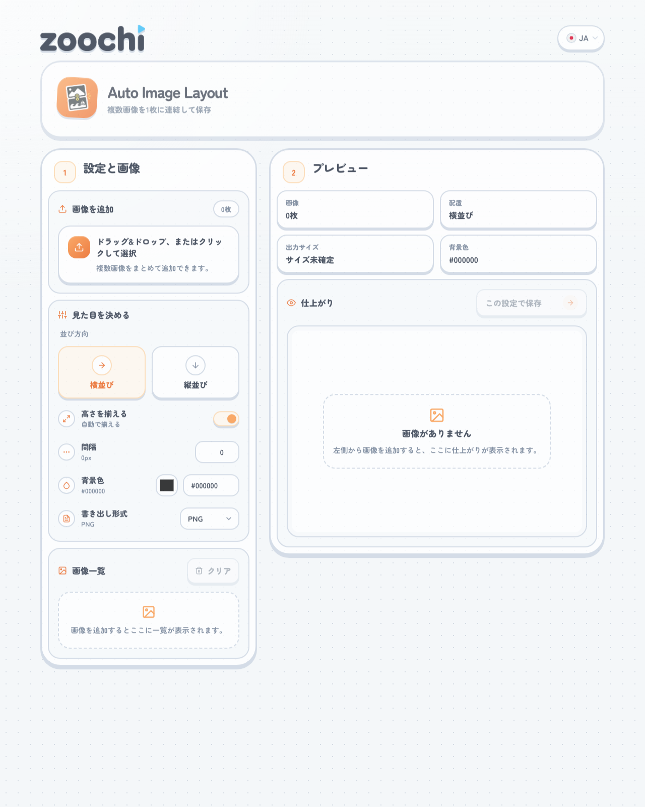
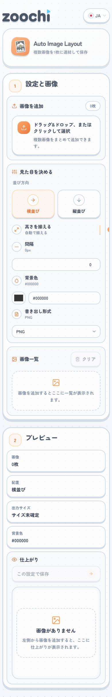

# Auto Image Layout 画面仕様

## 1. 対象画面

- 画面名: `Auto Image Layout`
- 用途: 複数画像を横または縦に連結し、1 枚の画像として保存する
- 記録対象: 公開ページのデスクトップ表示とモバイル表示

## 2. スクリーンショット

### デスクトップ

### モバイル

## 3. 画面全体の構成

### ヘッダー

- 左上に `zoochi` ロゴを配置し、トップページへ戻れる
- 右上に 6 言語対応の言語プルダウンを配置する
- その下にアプリアイコン、アプリ名、概要を並べたヘッダーカードを置く

### メインエリア

- デスクトップでは `設定と画像` と `プレビュー` の 2 カラム構成
- モバイルでは 1 カラムで縦に積み、設定エリアの後にプレビューを表示する

## 4. 画面要素

### 4-1. 設定と画像

- ステップ番号 `1` と見出し `設定と画像`
- `画像を追加`
  - ドラッグ&ドロップ用ドロップゾーン
  - クリックでもファイル選択できる
  - 画像枚数を右上ピルで表示する
- `見た目を決める`
  - `並び方向`
    - `横並び`
    - `縦並び`
  - `高さを揃える / 幅を揃える`
    - 並び方向に応じてラベルが切り替わる
    - スイッチで自動揃えの ON / OFF を切り替える
  - `間隔`
    - 画像間の余白を px 単位で指定する
  - `背景色`
    - カラーピッカーと HEX テキスト入力を併用する
    - 不正な色コードは補助メッセージで知らせる
  - `書き出し形式`
    - `PNG / JPEG / WebP`
- `画像一覧`
  - 追加済み画像の空状態またはカード一覧を表示する
  - 画像追加後はサムネイル、寸法、ファイルサイズを表示する
  - 上下移動ボタンとドラッグ&ドロップで並び順を変更する
  - 各画像の削除と全件クリアに対応する

### 4-2. プレビュー

- ステップ番号 `2` と見出し `プレビュー`
- サマリーカード
  - `画像`
  - `配置`
  - `出力サイズ`
  - `背景色`
- `仕上がり`
  - 現在の設定で描画したキャンバスを表示する
  - 空状態では案内メッセージを表示する
  - 右上の保存ボタンから現在の結果をダウンロードする

## 5. 主な状態

### 初期状態

- 画像未追加
- `画像一覧` と `仕上がり` は空状態を表示する
- 保存ボタンは無効

### 編集中

- 設定変更のたびにプレビューを再描画する
- 並び方向に応じて `高さを揃える / 幅を揃える` の表示が変わる

### エラー・制限

- 背景色が不正な HEX の場合は補助メッセージを表示する
- キャンバスサイズがブラウザ制限を超える場合は警告を表示し、保存を止める

## 6. レスポンシブ方針

- デスクトップでは 2 カラムを維持し、設定と結果を同時に比較しやすくする
- モバイルでは 1 カラムに落とし、操作順に沿って上から読める構成にする
- `並び方向` はモバイルでも 2 ボタンを横並びに保つ
- スイッチ、入力欄、色指定 UI は狭い幅でも横スクロールが出ないように調整する
